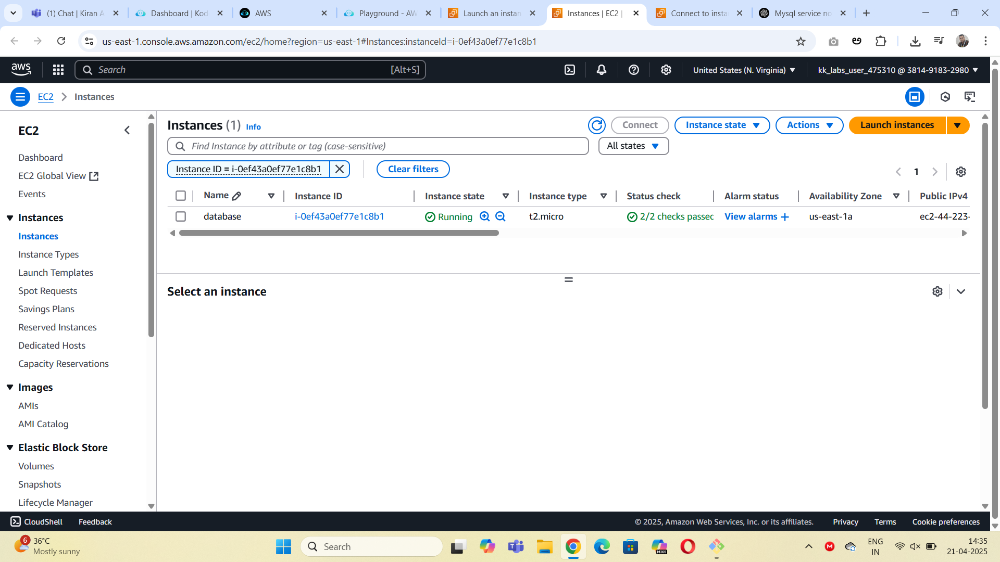
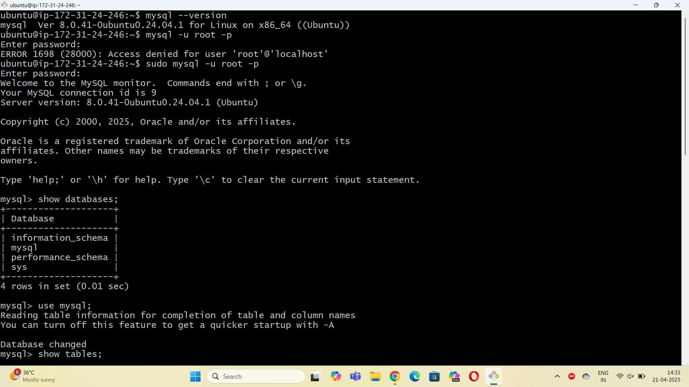
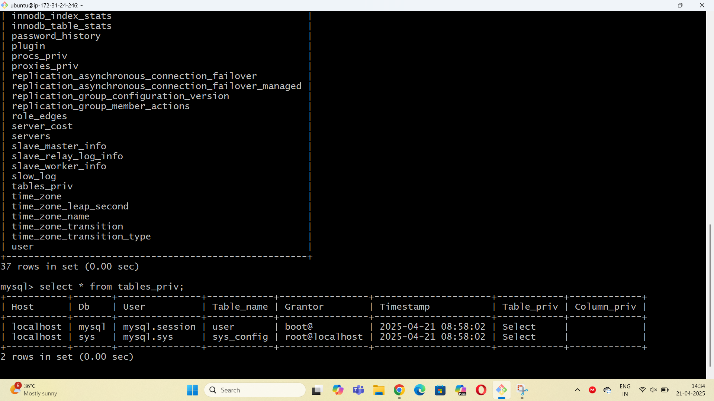

### Manual Installation of MYSQL Database

#### Step1:create a aws EC2 server and connect to terminal using ssh

#### Step2:update and install Mysql
```
sudo apt update

sudo apt install mysql-server -y

```
#### Step3: start and check the status of mysql service

```
sudo systemctl start mysql

sudo systemctl status mysql

```

#### Step4: access mysql database

```
sudo mysql -u root -p

```
#### output



