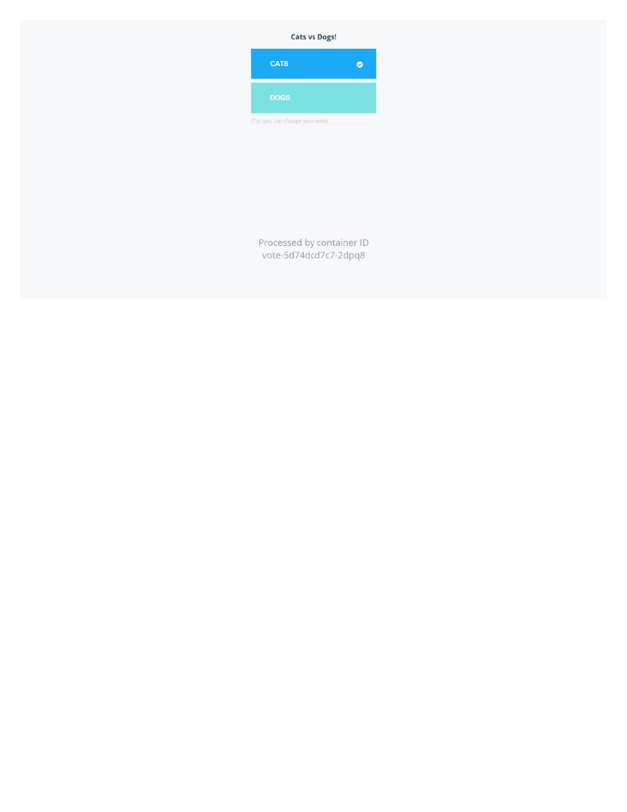
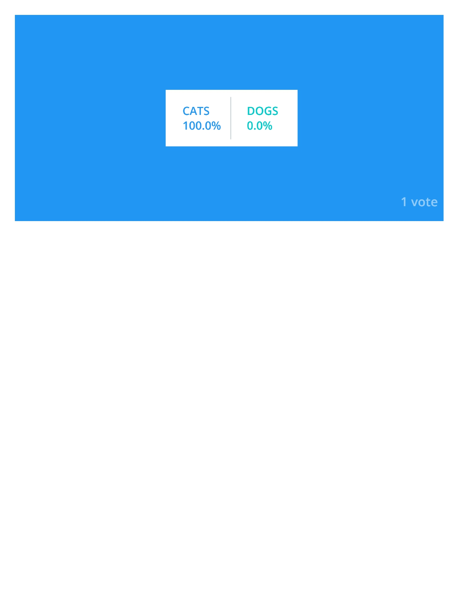

# 🐳 Example Voting App on Kubernetes with Ingress (AWS + Kops)

This guide walks you through deploying the [Example Voting App](https://github.com/akracad/example-voting-app) on a Kubernetes cluster set up using **Kops** on **AWS**, with **NGINX Ingress Controller** for external access.

---

## 📦 Prerequisites

- AWS CLI installed and configured
- `kubectl` and `kops` installed
- Ubuntu-based EC2 instance as the control machine
- IAM permissions for EC2, S3, Route53

---

## 🔧 Step 1: Install Required Tools

```bash
sudo apt update
sudo apt install -y unzip curl docker.io
```

### Install AWS CLI

```bash
curl "https://awscli.amazonaws.com/awscli-exe-linux-x86_64.zip" -o "awscliv2.zip"
unzip awscliv2.zip
sudo ./aws/install
aws configure
```

### Install Kops

```bash
curl -LO https://github.com/kubernetes/kops/releases/latest/download/kops-linux-amd64
chmod +x kops-linux-amd64
sudo mv kops-linux-amd64 /usr/local/bin/kops
```

### Install Kubectl

```bash
curl -LO "https://dl.k8s.io/release/$(curl -Ls https://dl.k8s.io/release/stable.txt)/bin/linux/amd64/kubectl"
chmod +x kubectl
sudo mv kubectl /usr/local/bin/
```

---

## 🌐 Step 2: Create S3 Bucket for Kops State

```bash
export KOPS_BUCKET_NAME=my-kops-state-$(date +%s)
aws s3api create-bucket --bucket $KOPS_BUCKET_NAME --region us-west-2 --create-bucket-configuration LocationConstraint=us-west-2
aws s3api put-bucket-versioning --bucket $KOPS_BUCKET_NAME --versioning-configuration Status=Enabled
export KOPS_STATE_STORE=s3://$KOPS_BUCKET_NAME
```

---

## ☁️ Step 3: Create the Kops Cluster

```bash
kops create cluster   --name=test.k8s.local   --zones=us-west-2a,us-west-2b   --node-size=t3.medium   --control-plane-size=t3.medium   --yes
```

### Validate

```bash
kops validate cluster --wait 10m
```

---

## 📥 Step 4: Clone the Voting App Repo

```bash
git clone https://github.com/akracad/example-voting-app.git
cd example-voting-app/k8s-specifications
```

---

## 🚀 Step 5: Deploy the App to Kubernetes

```bash
kubectl apply -f .
```

---

## 🌍 Step 6: Install Ingress-NGINX Controller

```bash
kubectl apply -f https://raw.githubusercontent.com/kubernetes/ingress-nginx/controller-v1.10.1/deploy/static/provider/cloud/deploy.yaml
```

Wait for the external IP:
```bash
kubectl get svc -n ingress-nginx
```

---

## 🧩 Step 7: Create Ingress Resource

### Create `ingress.yaml`:

```yaml
apiVersion: networking.k8s.io/v1
kind: Ingress
metadata:
  name: voting-ingress
  annotations:
    nginx.ingress.kubernetes.io/rewrite-target: /
spec:
  ingressClassName: nginx
  rules:
    - host: voting.test.k8s.local
      http:
        paths:
          - path: /
            pathType: Prefix
            backend:
              service:
                name: vote
                port:
                  number: 80
    - host: result.test.k8s.local
      http:
        paths:
          - path: /
            pathType: Prefix
            backend:
              service:
                name: result
                port:
                  number: 80
```

### Apply:

```bash
kubectl apply -f ingress.yaml
```

---

## 🧠 Step 8: Map Domain in `/etc/hosts`

Get ELB DNS:
```bash
kubectl get svc -n ingress-nginx
```

Sample:
```
a546da79e05944070a5f105ca50d51f2-1953470100.us-west-2.elb.amazonaws.com
```

Edit `/etc/hosts`:

```bash
sudo vi /etc/hosts
```

Add:

```
a546da79e05944070a5f105ca50d51f2-1953470100.us-west-2.elb.amazonaws.com voting.test.k8s.local result.test.k8s.local
```

---

## 🔍 Step 9: Test Access

### Curl test:

```bash
curl -H "Host: voting.test.k8s.local" http://<ELB-DNS>
curl -H "Host: result.test.k8s.local" http://<ELB-DNS>
```

### Or use browser:

- http://voting.test.k8s.local
- http://result.test.k8s.local

---

## ✅ Final Validation

Check:

```bash
kubectl get ingress voting-ingress
kubectl describe ingress voting-ingress
```

---
## Output:


.png)
.png)
## 📌 Troubleshooting

- ❌ **404 Error**: Check path, port, and rewrite annotation
- ❌ **Could not resolve host**: `/etc/hosts` entry missing or wrong
- ❌ **Ingress IP is pending**: Wait or check LoadBalancer provisioning in AWS

---

## 🧹 Clean Up (Optional)

```bash
kops delete cluster --name=test.k8s.local --yes
aws s3 rb $KOPS_STATE_STORE --force
```

---

## 📘 References

- [Kops Docs](https://kops.sigs.k8s.io/)
- [Ingress-NGINX](https://kubernetes.github.io/ingress-nginx/)
- [Voting App Repo](https://github.com/akracad/example-voting-app)

---
