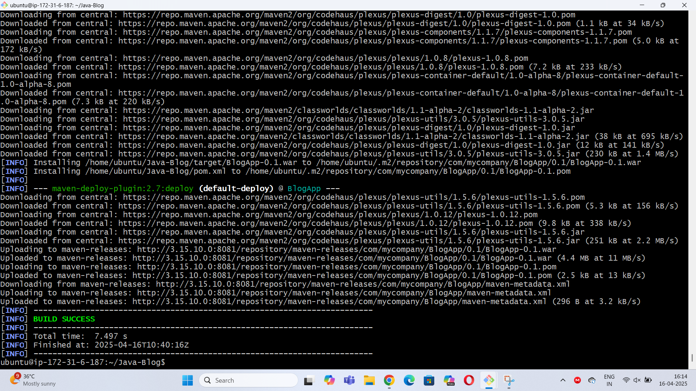
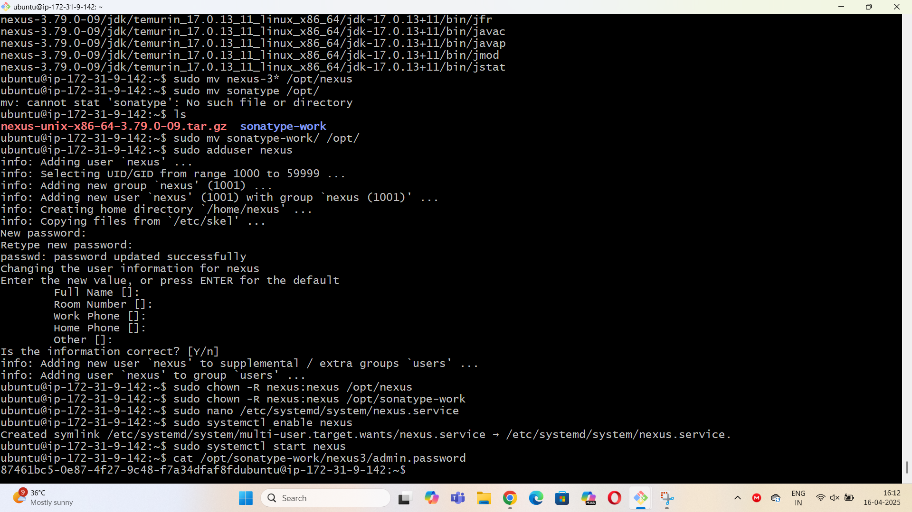
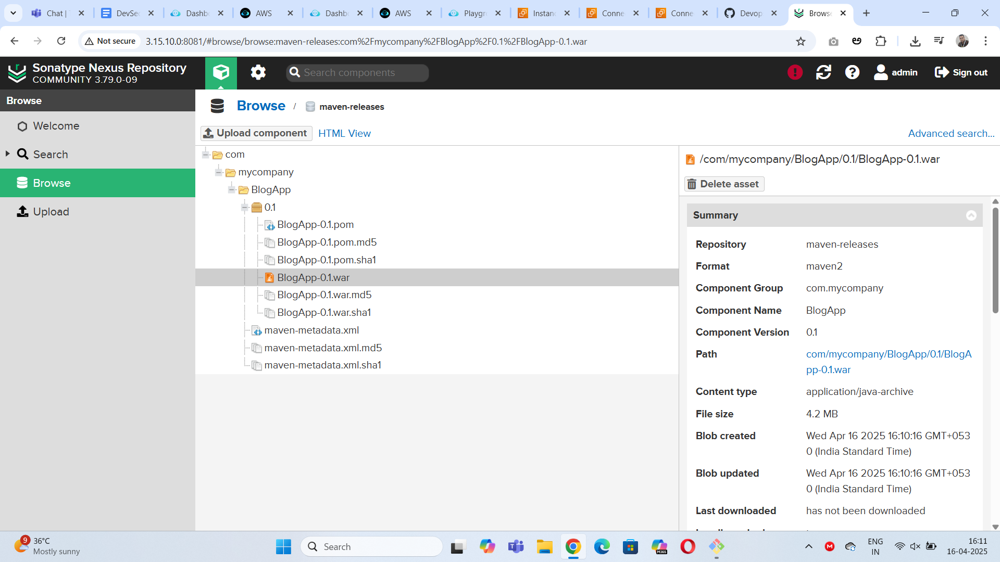

## Nexus Task with Java Application
### Github Repo: https://github.com/Rahuldepp/Java-Blog.git

### Step1:create java build server using aws EC2 and connect with ssh
### Step2: Install Java
``` 
sudo apt update
sudo apt install openjdk-11-jdk -y
```
### Step3: Install Maven

```
sudo apt install maven

```
### Step4: clone the java repository
```
git clone https://github.com/Rahuldepp/Java-Blog.git

```
### Step5: build the package using maven

```
mvn package
```
### build output

### Step6: Create nexus server using aws EC2 and connect with ssh

### Step7:Download nexus and unzip
```
wget https://download.sonatype.com/nexus/3/nexus-unix-x86-64-3.79.0-09.tar.gz
tar -xvzf latest-unix.tar.gz
sudo mv nexus-3* /opt/nexus
sudo mv sonatype /opt/
```
### Step8:create user file and service file

```
sudo adduser nexus
sudo chown -R nexus:nexus /opt/nexus
sudo chown -R nexus:nexus /opt/sonatype-work
sudo nano /etc/systemd/system/nexus.service

[Unit]
Description=nexus service
After=network.target

[Service]
Type=forking
LimitNOFILE=65536
ExecStart=/opt/nexus/bin/nexus start
ExecStop=/opt/nexus/bin/nexus stop
User=nexus
Restart=on-abort

[Install]
WantedBy=multi-user.target
```

### step9:start and enable the nexus and open in the browser by using public ip address
```
sudo systemctl enable nexus
sudo systemctl start nexus

```
### Step10: update the pom.xml in the java server

```
Vim pom.xml

</dependencies>
<distributionManagement>
  <repository>
    <id>maven-releases</id>
    <url>http://172.178.116.75:8081/repository/maven-releases/</url>
  </repository>
</distributionManagement>
```
### Step11: clean and deploy

```
mvn clean deploy

```
### output




