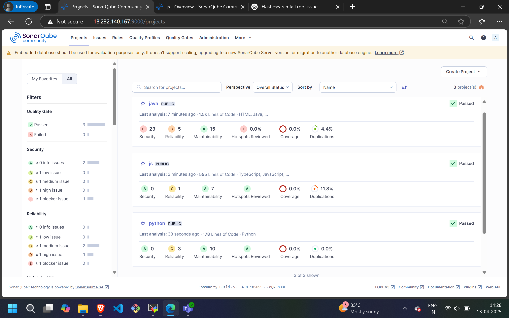

### Sonar Analysis with python Application
### Repo:https://github.com/MainakRepositor/Car-Premium-Prediction.git
#### Step1:create a EC2 server for python application

#### Step2:connect the server using ssh

#### Step3: clone the git repository
git clone https://github.com/MainakRepositor/Car-Premium-Prediction.git

### Step4: Verify python3 is installed or not
python --version

### Step5: Create Another EC2 Server for SonarQube and connect with ssh

### Step6: Install Java and Sonarqube

#### sudo apt update 
#### sudo apt install unzip
#### sudo apt install openjdk-17-jre-headless 

#### wget https://binaries.sonarsource.com/Distribution/sonarqube/sonarqube-25.4.0.105899.zip
#### unzip sonarqube-25.4.0.105899.zip

### Step7: start and check the status of Sonar Server
#### cd sonarqube-25.4.0.105899/bin/linux-x86-64
#### ./sonar.sh start
#### ./sonar.sh status

### Step8: Use publicip:9000 to open sonarqube server and reset the password

### Step9: create a local project in the name of python with necessary configuration a code will be generated

  #### sonar-scanner   -Dsonar.projectKey=py_code   -Dsonar.sources=.   -Dsonar.host.url=http://44.202.193.53:9000   -Dsonar.token=sqp_1ff64fd5e0cb318a146773dfc5838c5fde1c2f66

### Step10: Paste the code in python server and sonar will execute the analysis

### Output:

